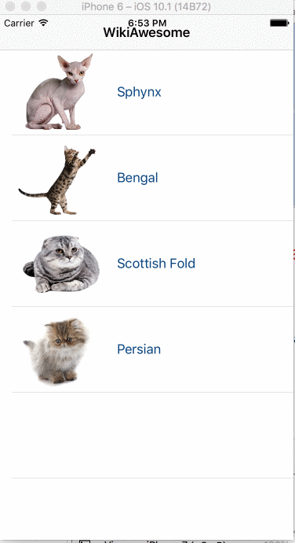

# WikiAwesome
> Swift 3 template to help students learn the fundamentals of Xcode and iOS app development

## Installation

Ensure you have Xcode installed. Double click the wikiawesome.xcopdeproj file to open

## Usage example

Create your own Wikipedia app! Teaches the fundamentals of arrays, appending arrays, importing images, and customizing interfaces

## Meta

Alice Walker – [@atatwalker](https://twitter.com/aliceemmwalker)

 This work is licensed under a <a rel="license" href="http://creativecommons.org/licenses/by-nc/4.0/">Creative Commons Attribution-NonCommercial 4.0 International License</a>.

[https://github.com/atatwalker/wikiawesome](https://github.com/atatwalker)

[npm-image]: https://img.shields.io/npm/v/datadog-metrics.svg?style=flat-square
[npm-url]: https://npmjs.org/package/datadog-metrics
[npm-downloads]: https://img.shields.io/npm/dm/datadog-metrics.svg?style=flat-square

